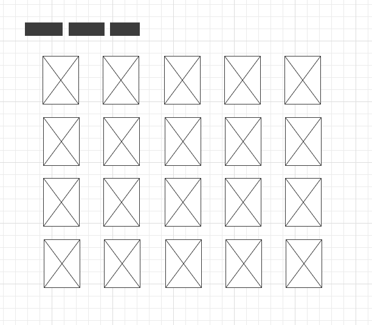

# Juno x ecobee: Pair Programming Exercise
**July 22, 2020**

For today's pairing exercise, we will be using React to build a movie dashboard application, pulling data from the [Movie Database API](https://developers.themoviedb.org/3/getting-started/introduction/). 

The app has been set up with some basic functionality (a trending movies homepage that connects to the API). In addition to helping us get started with pairing faster and allowing us to focus on the programming elements of the exercise, this will also give you, the students, the opportunity to practice reading and understanding existing code.

> A wireframe of the homepage of our app

## The Exercise
In today's session, with the guidance and support of your mentors you will adding two new features – click-through movie summary cards and a search functionality – to the app. You can do these exercises in any order, and complete as much of them as you would like before moving on. **It's okay if you don't finish all of the exercises in full** – the goal is not to have a completed app by the end of this session; rather, we want to focus on having a positive pairing and learning experience, regardless of what the final outcome of your app is!

### Feature #1: Movie Details Card

For this exercise, you will be adding the ability for users to click on a movie on the homepage and see a popup card with additional details. The full instructions for this exercise can be found **[here](exercises/1-movie-card.md)**.

### Feature #2: Search Functionality

For this exercise, you will be adding search functionality to the homepage to allow users to look up the first page of movie results for their chosen search term. The full instructions for this exercise can be found **[here](exercises/2-search.md)**.

## MovieDB API Access

In order to make requests to the MovieDB API, you will need to create an account and obtain an API key. 

If you don't already have one, you can create an account [here](https://www.themoviedb.org/account/signup). 

Once your account is created, you can follow the steps in the [environment variables documentation](docs/environment_variables.md) we've included. **Please take a moment to do this now and make sure you are able to load the app and call the API.** If you are having trouble with this, please reach out to a mentor.

## General Pairing Notes 

Pairing is a great way to learn new concepts and practice collaborating with your teammates. It's something we at ecobee do a lot and it's a critical skill to have as a developer. Below, we've included some tips to help the process run smoothly:
- Don't be afraid to ask questions – that's how we learn! 
- You may feel nervous to pair with professional developers; remember that your mentors were once in your position (some of them literally) and are here to help you, not to judge your skills or knowledge.
- Flexibility is okay; the exercises we've provided are meant to offer structure, but if you decide you want to focus on something different, extend an exercise or build out your own functionality entirely, that's okay too! (However, keep in mind that we'll only be providing solutions to the exercises we've outlined and make sure to communicate with your pairing partners before switching gears.)

## Scripts

In the project directory, you can run:

### `npm install`

Installs all dependencies.

### `npm run start`

Runs the app in the development mode. 
Open [http://localhost:3000](http://localhost:3000) to view it in the browser.

The page will reload if you make edits. 
You will also see any lint errors in the console.
