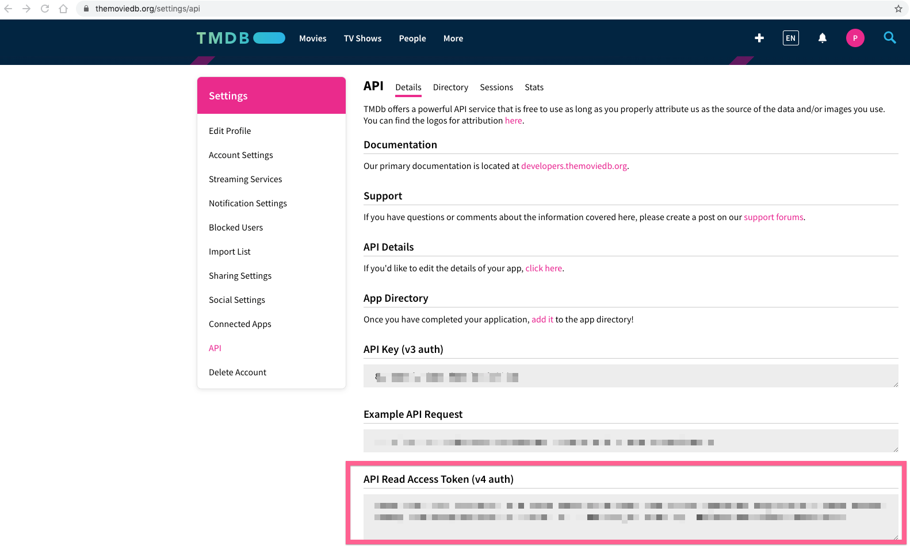

# Environment Variables

We will be setting variables locally in development environments (not in production!) by creating `.env.local` on our root directory and populating with the key/values that you want. There is an example file called `.env.example` that goes over how to set values. This is the preferred method of setting environment variables for your local development environment as the file is in the .gitignore and will not be included in production environments.

## REACT_APP_API_KEY
In order to call the MovieDB API, we need an API key. The API key will allow us to get the list of movies, their details and so much more! We can generate the API key by first creating an account through [The Movie Database](https://www.themoviedb.org/login) and following the steps described [here:](https://developers.themoviedb.org/3/getting-started/introduction)

We will be using the `v4` auth key from their [API Settings page](https://www.themoviedb.org/settings/api)



This token is expected to be sent along as a Authorization header. A simple cURL example looks like the following:

```bash
curl --request GET \
  --url 'https://api.themoviedb.org/3/movie/76341' \
  --header 'Authorization: Bearer <<API_KEY>>' \
  --header 'Content-Type: application/json;charset=utf-8'
```

In our application we will be using the API key by passing it along as a Authorization header in fetch:

```javascript
class MyComponent extends React.Component {
  constructor(props) {
    super(props);
    this.state = {
      error: null,
      isLoaded: false,
      movies: []
    };
  }

  componentDidMount() {
    fetch("https://api.themoviedb.org/3/trending/movie/day?page=1", {
      headers: {
        Authorization: `Bearer ${process.env.REACT_APP_API_KEY}`,
        "Content-Type": "application/json;charset=utf-8",
      },
    })
      .then((res) => res.json())
      .then(
        (res) => {
          console.log({ res });
          this.setState({
            isLoaded: true,
            movies: res.results,
          });
        },
        // Note: it's important to handle errors here
        // instead of a catch() block so that we don't swallow
        // exceptions from actual bugs in components.
        (error) => {
          this.setState({
            isLoaded: true,
            error,
          });
        }
      );
  }

  render() {
    const { error, isLoaded, movies } = this.state;
    if (error) {
      return <div>Error: {error.message}</div>;
    } else if (!isLoaded) {
      return <div>Loading...</div>;
    } else {
      return (
        <ul>
          {movies.map((movie) => (
            <li key={movie.id}>
              {movie.title} : {movie.overview}
            </li>
          ))}
        </ul>
      );
    }
  }
}

```