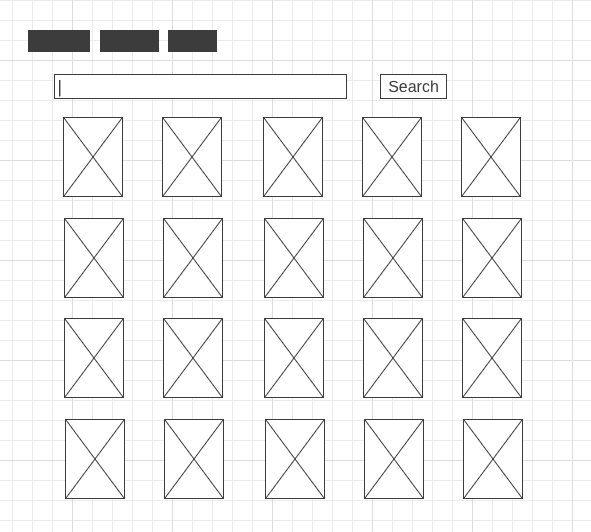

# Exercise 2: Building search functionality

For our second exercise, you'll be adding search functionality to the homepage that will allow the user to search for a movie and display the first page of results. 

## Details
### User story

As developers, we're often presented with user stories that define the requirements for a new feature. Your user story is as follows:

**As a user, I would like to be able to search for a movie on the homepage and see the first page of results**

### Acceptance criteria

User stories typically come with a set of acceptance criteria, which should be met in order for the feature to be considered complete (but a reminder, you don't necessarily **have** to complete all of it for the purposes of our exercise). Your acceptance criteria for this feature is: 

- [ ]  Search bar component should accept input and update the search term on every change
- [ ]  On submission of a search ("enter" or clicking search button), make a GET request to `GET /search/movie` endpoint to get **first page only** of matching results ([documentation here](https://developers.themoviedb.org/3/search/search-movies))
- [ ]  On successful search, replace placeholder trending movies with results; each movie card component should include same details as initial trending homepage, i.e. poster, release date, rating, title
- [ ]  Handle case where there are no search results returned
- [ ]  Handle case where an error is returned from the API
- [ ]  (Bonus) Add validation to prevent users from searching terms that will result in an error (e.g. empty strings)